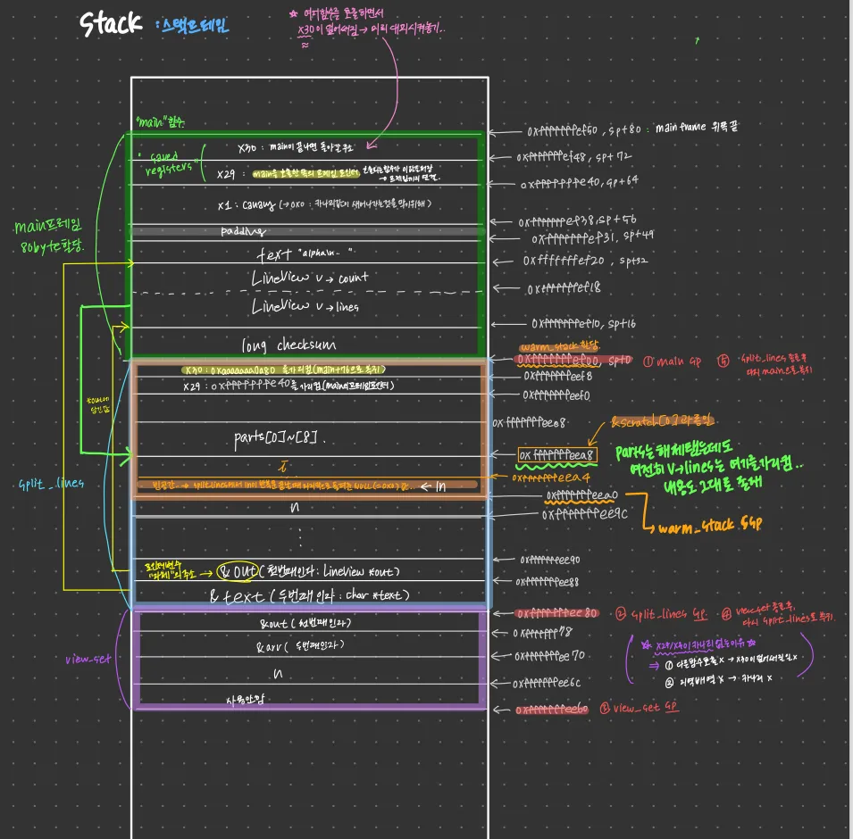

# 07_stack_use_after_return

함수가 **자기 지역 배열의 주소를 바깥(호출한 쪽)에 넘겨준 뒤 리턴**하면서, 호출한 쪽이 이미 반납된 스택 공간을 계속 사용하는 **stack use-after-return** 문제를 gdb로 추적하고 수정한 예제이다.

## 실행 결과 (수정 전)

```
Starting program: /work/build/07_stack_use_after_return
[Thread debugging using libthread_db enabled]
Using host libthread_db library "/lib/aarch64-linux-gnu/libthread_db.so.1".

Program received signal SIGSEGV, Segmentation fault.
main () at challenges/07_stack_use_after_return/bug.c:45
45              checksum += (unsigned char)v.lines[i][0];
```

## 코드 구조

```c
#define MAX_LINES 8
typedef struct {
    char **lines;
    int    count;
} LineView;

static void view_set(LineView *out, char **arr, int n) {
    out->lines = arr;
    out->count = n;
}

static void split_lines(LineView *out, char *text) {
    char *parts[MAX_LINES];                 /* split_lines의 지역 배열 */
    int n = 0;
    for (char *ln = strtok(text, "\n"); ln && n < MAX_LINES; ln = strtok(NULL, "\n"))
        parts[n++] = ln;
    view_set(out, parts, n);                /* 지역 배열의 주소를 out->lines에 저장 */
}

static void warm_stack(void) {
    char *scratch[MAX_LINES];
    for (int i = 0; i < MAX_LINES; i++)
        scratch[i] = (char *)0x4141414141414141ULL;
    __asm__ volatile("" :: "r"(scratch) : "memory");
}

int main(void) {
    char text[] = "alpha\nbeta\ngamma";
    LineView v;
    split_lines(&v, text);
    warm_stack();
    long checksum = 0;
    for (int i = 0; i < v.count; i++)
        checksum += (unsigned char)v.lines[i][0];
    printf("lines = %d, checksum = %ld\n", v.count, checksum);
    return 0;
}
```

- `split_lines` : `text`를 줄 단위로 나눠 각 줄의 시작 주소를 `parts`에 담고, `view_set`으로 `v.lines = parts`를 설정한다.
- `warm_stack` : 프로그램 기능과는 무관한 **과제용 장치**. 지역 배열 `scratch`를 `0x4141414141414141`(`"AAAAAAAA"`)로 채워, 직전에 리턴한 함수가 쓰던 스택 자리를 일부러 덮어쓴다. `__asm__ volatile` 줄은 컴파일러가 "쓰지 않는 배열"이라며 이 채우기를 최적화로 지우지 못하게 막는다.

## 배경 지식

- **`sp` (stack pointer)** : 스택의 현재 꼭대기 주소를 담는 레지스터. 스택은 낮은 주소 방향으로 자라며, 함수가 호출되면 `sp`를 내려서 공간(스택 프레임)을 확보하고, 리턴하면 `sp`를 다시 올린다.
- **`x29` (frame pointer)** : 현재 함수 스택 프레임의 기준점을 가리키는 레지스터
- **`x30` (link register)** : 함수가 끝나면 돌아갈 주소를 담는 레지스터. 함수 안에서 다른 함수를 호출하면 덮어써지므로, 프롤로그에서 `x29`와 함께 스택에 저장해 둔다.

## 분석 1. main의 스택 프레임

```
(gdb) info frame
Stack level 0, frame at 0xffffffffef50:              ← main 프레임의 위쪽 끝
 pc = 0xaaaaaaaa0a40 in main (…/bug.c:37);           ← 지금 실행하려는 명령어 주소
    saved pc = 0xfffff7e184c4                        ← main이 끝나면 돌아갈 주소 (glibc)
 source language c.
 Arglist at 0xffffffffef40, args:                    ← 인자를 찾을 때의 기준 주소 (x29)
 Locals at 0xffffffffef40, Previous frame's sp is 0xffffffffef50
 Saved registers:
  x29 at 0xffffffffef40, x30 at 0xffffffffef48       ← 저장된 x29, x30의 위치
```

```
(gdb) p $sp
$1 = (void *) 0xffffffffef00
(gdb) p &text
$2 = (char (*)[17]) 0xffffffffef20
(gdb) p &v
$3 = (LineView *) 0xffffffffef10
(gdb) p &checksum
$4 = (long *) 0xffffffffef08
```

main의 프레임은 `0xffffffffef00` ~ `0xffffffffef50`(80바이트)이다.

```
주소            내용
──────────────────────────────────────
0xffffffffef50  ← main 프레임 위쪽 끝
0xffffffffef48    x30 (돌아갈 주소)
0xffffffffef40    x29 (이전 프레임 포인터)
0xffffffffef38    스택 카나리
0xffffffffef20    text[17]
0xffffffffef10    v {lines, count}
0xffffffffef08    checksum
0xffffffffef00  ← main의 sp
──────────────────────────────────────
```

참고로 `checksum`은 `split_lines` 호출 **뒤**에 선언되지만, 지역 변수 공간은 함수 프롤로그(`sub sp, sp, #0x50`)에서 **한꺼번에** 확보되므로 처음부터 자리가 있다. 선언 위치는 이름을 쓸 수 있는 범위와 초기화 시점만 정한다.

## 분석 2. split_lines가 넘겨준 주소

`split_lines` 안에서 `parts`의 주소와 내용을 확인하면 다음과 같다.

```
(gdb) p &parts
$3 = (char *(*)[8]) 0xffffffffeea8
(gdb) p parts
$26 = {0xffffffffef20 "alpha", 0xffffffffef26 "beta", 0xffffffffef2b "gamma", 0x0, 0x0, 0x0, 0x0, 0x0}
```

`parts`의 각 원소는 `main`의 `text` 안을 가리키므로 유효하다. 그런데 `view_set`을 거치면 `out->lines`에는 **`parts` 배열 자체의 주소**가 저장된다.

```
(gdb) p out->lines
$30 = (char **) 0xffffffffeea8
(gdb) p out->lines[0]
$32 = 0xffffffffef20 "alpha"
```

`split_lines` 프레임의 범위를 확인하면, `parts`는 `main`의 프레임이 아니라 **`split_lines` 자신의 프레임 안**에 있다.

```
(gdb) info frame
Stack level 0, frame at 0xffffffffef00:              ← main의 sp에서 바로 시작
 …
 called by frame at 0xffffffffef50
 Saved registers:
  x29 at 0xffffffffeef0, x30 at 0xffffffffeef8
(gdb) p $sp
$8 = (void *) 0xffffffffee80
```

```
주소            내용
──────────────────────────────────────
0xffffffffef00  ← split_lines 프레임 위쪽 끝 (= main의 sp)
0xffffffffeef8    x30 = main+76 (복귀 주소)
0xffffffffeef0    x29 = 0xffffffffef40
0xffffffffeea8    parts[8]   ◄── out->lines (= main의 v.lines)
0xffffffffee9c    n
0xffffffffee88    out  = 0xffffffffef10 (main의 v)
0xffffffffee80    text = 0xffffffffef20 (main의 text)
                ← split_lines의 sp
──────────────────────────────────────
```

즉 `main`의 `v.lines`가 **`split_lines` 프레임 안의 주소**를 가리키게 된다.

## 분석 3. split_lines 리턴 후

`main`으로 돌아온 뒤 확인하면 다음과 같다.

```
(gdb) p v
$34 = {lines = 0xffffffffeea8, count = 3}
(gdb) p &parts
No symbol "parts" in current context.
```

`split_lines`가 끝났으므로 `parts`라는 이름은 더 이상 쓸 수 없고, 그 공간은 반납되었다. 그런데 `v.lines`는 여전히 `0xffffffffeea8`, 즉 옛 `parts`의 주소를 가리키고 있다. 이 주소는 이제 `main`의 `sp`(`0xffffffffef00`)보다 **아래**, 어떤 함수의 프레임에도 속하지 않는 자리다.

### 반납됐는데 왜 내용이 남아 있을까

`split_lines`가 리턴할 때의 에필로그는 사실상 다음과 같다.

```asm
add  sp, sp, #0x80
ret
```

`sp`를 올릴 뿐, 그 아래 메모리를 지우는 명령은 없다. "반납"은 "이 자리는 이제 비어 있는 것으로 친다"는 약속일 뿐이고, 실제 내용은 **누군가 덮어쓸 때까지 그대로 남아 있다.** 그래서 이 시점에는 `v.lines`로 읽어도 우연히 올바른 값이 나온다.

## 분석 4. warm_stack이 같은 자리를 재사용

```
(gdb) break warm_stack
(gdb) continue
Breakpoint 2, warm_stack () at …/bug.c:29
(gdb) info frame
Stack level 0, frame at 0xffffffffef00:              ← main 바로 아래에서 시작
 pc = 0xaaaaaaaa09ac in warm_stack (…/bug.c:29);     ← 아직 함수 본문 실행 전
    saved pc = 0xaaaaaaaa0a84                        ← main+80 (bl warm_stack 다음 명령어)
 called by frame at 0xffffffffef50
 Arglist at 0xffffffffeef0, args:                    ← warm_stack(void)라 인자 없음
 Locals at 0xffffffffeef0, Previous frame's sp is 0xffffffffef00
 Saved registers:
  x29 at 0xffffffffeef0, x30 at 0xffffffffeef8
(gdb) p $sp
$38 = (void *) 0xffffffffeea0
(gdb) p &scratch
$39 = (char *(*)[8]) 0xffffffffeea8
```

`split_lines`와 나란히 비교하면 스택 재사용이 숫자로 확인된다.

| | split_lines | warm_stack |
|---|---|---|
| `frame at` (위쪽 끝) | `0xffffffffef00` | `0xffffffffef00` |
| 저장된 `x29` / `x30` 위치 | `eef0` / `eef8` | `eef0` / `eef8` |
| 배열 주소 | `&parts` = `eea8` | `&scratch` = `eea8` |
| `sp` (아래쪽 끝) | `ee80` | `eea0` |
| `saved pc` | `0a80` (main+76) | `0a84` (main+80) |

두 함수 모두 `main`에서 같은 깊이로 호출되었으므로, 호출 시점의 `main`의 `sp`(`ef00`)부터 프레임이 시작된다. 스택은 "지금 `sp`부터 아래로 잘라 쓴다"는 규칙으로만 관리되기 때문에, 연달아 호출된 함수들은 **같은 스택 자리를 번갈아 쓰게** 된다. 게다가 두 함수 모두 배열을 카나리 바로 아래에 두고 크기도 같아서, `scratch`는 정확히 옛 `parts` 자리에 놓인다.

### warm_stack 실행 전후 비교

```
29      static void warm_stack(void) {
(gdb) x/3ag 0xffffffffeea8
0xffffffffeea8: 0xffffffffef20  0xffffffffef26
0xffffffffeeb8: 0xffffffffef2b

(gdb) finish
main () at …/bug.c:46
46          long checksum = 0;

(gdb) x/3ag 0xffffffffeea8
0xffffffffeea8: 0x4141414141414141      0x4141414141414141
0xffffffffeeb8: 0x4141414141414141
```

| 시점 | `0xffffffffeea8`의 내용 | 의미 |
|---|---|---|
| `warm_stack` 진입 직후 | `ef20`, `ef26`, `ef2b` | 반납됐지만 옛 `parts` 값이 그대로 남아 있음 |
| `warm_stack` 종료 후 | `0x4141…` × 3 | `scratch`가 같은 자리를 덮어씀 |

`main`은 그 사이에 아무것도 하지 않았는데, `v.lines`가 가리키는 내용이 **다른 함수에 의해 바뀌었다.** 이것이 stack use-after-return이다.

이후 체크섬 반복문에서 `v.lines[0]`은 `0x4141414141414141`이 되고, `[0]`으로 그 주소의 1바이트를 읽으려는 순간 매핑되지 않은 주소이므로 **SIGSEGV**가 발생한다.

## 해결

핵심은 **포인터 배열의 수명이 그것을 사용하는 쪽(`main`)보다 짧으면 안 된다**는 것이다. 이를 위한 방법은 두 가지다.

### 방법 1. 호출자 제공 버퍼 (caller-provided buffer)

포인터 배열을 `split_lines`가 아니라 **호출하는 쪽인 `main`에서 준비**하고, `split_lines`는 그 공간에 채워 넣기만 한다.

```c
static void split_lines(LineView *out, char *text) {
    int n = 0;
    for (char *ln = strtok(text, "\n"); ln && n < MAX_LINES; ln = strtok(NULL, "\n"))
        out->lines[n++] = ln;       /* 호출자가 준비한 배열에 채워 넣기 */
    out->count = n;
}

int main(void) {
    char text[] = "alpha\nbeta\ngamma";
    char *parts[MAX_LINES];         /* main 프레임 안에 배열 준비 */

    LineView v;
    v.lines = parts;                /* v.lines가 그 배열을 가리키게 함 */

    split_lines(&v, text);
    warm_stack();
    ...
}
```

`parts`가 `main`의 지역 배열이 되었으므로 `main`이 끝날 때까지 살아 있다. `split_lines`와 `warm_stack`의 프레임은 항상 `main`의 `sp` **아래**에 잡히므로 이 배열을 덮어쓸 수 없다.

이 과정에서 처음에는 `v.lines = parts;` 없이 실행했다가 다음과 같은 크래시가 났다.

```
Program received signal SIGSEGV, Segmentation fault.
0x0000aaaaaaaa090c in split_lines (out=0xffffffffef10, text=0xffffffffef20 "alpha")
    at challenges/07_stack_use_after_return/bug.c:24
24              out->lines[n++]=ln;
```

`LineView v;`만 선언하면 `v.lines`는 아무 곳도 가리키지 않는다(이 실행에서는 `0x0`). 포인터 변수는 담을 공간이 아니라 **공간이 어디 있는지 적는 칸**일 뿐이므로, 실제 배열을 먼저 마련하고 그 주소를 넣어 줘야 `lines[n]`에 쓸 수 있다.

이 방법은 `malloc`을 쓰지 않으므로 `free`도 필요 없다.

### 방법 2. 힙 할당 (`malloc`)

포인터 배열을 스택이 아닌 **힙**에 할당한다. 힙 메모리는 `free`하기 전까지 살아 있으므로 `split_lines`가 리턴해도 사라지지 않는다.

```c
static void split_lines(LineView *out, char *text) {
    char **parts = malloc(sizeof(char *) * MAX_LINES);   /* 힙에 char * 8칸 */
    int n = 0;
    for (char *ln = strtok(text, "\n"); ln && n < MAX_LINES; ln = strtok(NULL, "\n"))
        parts[n++] = ln;
    view_set(out, parts, n);
}

int main(void) {
    ...
    printf("lines = %d, checksum = %ld\n", v.count, checksum);
    free(v.lines);                  /* 포인터 배열만 해제 */
    return 0;
}
```

- `parts`가 `char **`인 이유: 원소 하나하나가 `char *`(문자열 포인터)이므로, 그런 원소들의 배열을 가리키는 포인터는 `char **`가 된다.
- `free(v.lines)`는 `malloc`으로 만든 **포인터 배열(64바이트)만** 해제한다. 배열 안의 포인터들은 `main`의 스택 배열 `text`를 가리키므로 해제하면 안 된다.
- `malloc` 실패 시 `NULL`이 반환되므로, 실제로는 검사를 추가해야 한다.

### 두 방법 비교

| | 방법 1. 호출자 제공 버퍼 | 방법 2. 힙 할당 |
|---|---|---|
| 배열 위치 | `main`의 스택 | 힙 |
| 배열 소유자 | 처음부터 `main` | `split_lines`가 만들어 `main`에 넘김 |
| 해제 | 필요 없음 (자동) | `main`에서 `free` 필요 |
| 크기 | 컴파일 시점에 고정 | 실행 중에 정할 수 있음 |
| 실패 가능성 | 없음 | `malloc` 실패 처리 필요 |

크기가 작고 고정되어 있으면 방법 1이 더 단순하고 안전하고, 줄 수를 미리 알 수 없거나 아주 크면 방법 2가 맞다.

수정 후 실행 결과는 `'a'`(97) + `'b'`(98) + `'g'`(103)이므로 다음과 같다.

```
lines = 3, checksum = 298
```

## 정리

- 지역 변수는 그 함수가 리턴하면 반납된다. **포인터를 사용하는 쪽보다 가리키는 대상이 먼저 사라지면 안 된다.**
- 스택은 리턴 시 내용을 지우지 않으므로, 반납된 자리를 읽어도 한동안은 멀쩡해 보인다. 버그가 드러나는 것은 다른 함수가 같은 자리를 덮어쓴 뒤다.
- 같은 함수에서 연달아 호출된 함수들은 거의 같은 스택 자리를 재사용한다.

## 남은 개선점

방법 1에서 `split_lines`는 `out->lines`가 **최소 `MAX_LINES`칸**이라고 가정하고 쓴다. 호출하는 쪽이 더 작은 배열을 넘기면 스택 버퍼 오버플로가 발생하므로, 실제로는 `snprintf(buf, size, …)`처럼 **용량도 함께 넘기고** 그 범위까지만 쓰도록 하는 것이 안전하다.

----

## 스택 프레임 구조 
