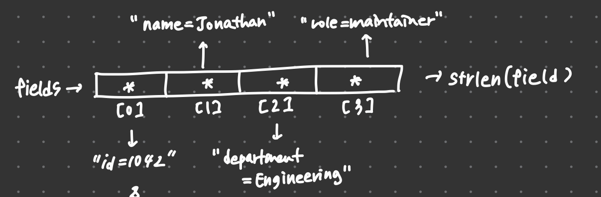

# 16_unused_cap_overflow

버퍼 크기(`cap`)를 인자로 받아 놓고 실제로는 검사에 쓰지 않아서 발생하는 **스택 버퍼 오버플로** 문제를 분석하고 수정한 예제이다.
<Br/><br/>

## 실행 결과 (수정 전)

```
Starting program: /work/build/16_unused_cap_overflow
[Thread debugging using libthread_db enabled]
Using host libthread_db library "/lib/aarch64-linux-gnu/libthread_db.so.1".
record = id=1042|name=Jonathan|department=Engineering|role=maintainer
*** stack smashing detected ***: terminated

Program received signal SIGABRT, Aborted.
0x0000fffff7e774d8 in ?? () from /lib/aarch64-linux-gnu/libc.so.6
```

백트레이스 일부:

```
#4  0x0000fffff7ee82a8 in __fortify_fail () from /lib/aarch64-linux-gnu/libc.so.6
#5  0x0000fffff7ee9264 in __stack_chk_fail () from /lib/aarch64-linux-gnu/libc.so.6
```

| 항목 | 의미 |
|---|---|
| `SIGABRT` | 하드웨어가 아니라 소프트웨어(라이브러리)가 이상을 감지하고 `abort()`로 직접 중단시킴 |
| `__stack_chk_fail` | 스택 보호 장치(stack canary)가 깨졌음을 감지 |
| `__fortify_fail` | 보안 검사에 걸렸을 때 `*** stack smashing detected ***` 같은 메시지를 출력하고 `abort()`를 호출하는 공통 종료 함수 |

**결론:** 스택에 있는 지역 버퍼가 넘쳤고, 함수가 리턴하는 시점에 카나리 검사로 이를 알아차렸다.

출력을 보면 `record = ...`가 끝까지 정상적으로 찍힌 **뒤에** 크래시가 난다. 넘쳐 쓰기는 `build_record` 안에서 이미 일어났지만, 카나리 검사는 `rec`를 지역 변수로 가진 `main`이 **리턴할 때** 수행되기 때문이다. 즉 버그가 발생한 위치와 크래시가 드러난 위치가 다르다.

<br/><br/>

## 원인 분석

`main`의 `rec`는 24바이트 배열이고, 여기에 `fields` 포인터 배열이 가리키는 문자열들을 구분자 `|`로 이어 붙인다.



필드 문자열 자체가 길고, 구분자와 끝의 널 문자까지 들어가야 하므로 24바이트는 금방 넘칩니다. 문자열을 넣는 `append_field`는 다음과 같다.

```c
static void append_field(char *buf, size_t cap, size_t *len, const char *field, char sep) {
    if (*len > 0) {
        buf[(*len)++] = sep;
    }

    size_t flen = strlen(field);
    for (size_t i = 0; i < flen; i++) {
        buf[(*len)++] = field[i];
    }
    buf[*len] = '\0';
    (void)cap;    /* cap을 받아 놓고 사용하지 않음 */
}
```

`cap`을 인자로 받지만 `(void)cap;`으로 버리기만 할 뿐, **쓰기 전에 버퍼에 남은 공간이 있는지 전혀 확인하지 않는다.** 그래서 전체 길이가 24바이트를 넘어도 그대로 배열 밖에 써 버린다.

<br/><br/>

## 해결 과정

### 시도 1. `cap`을 남은 공간으로 줄여 가며 검사 (실패)

`len`처럼 `cap`도 포인터로 넘겨서, 필드를 쓸 때마다 `cap`에서 사용한 바이트 수를 빼 **남은 공간**으로 갱신하고, `build_record`에서 이를 검사하는 방식을 시도했다.

```c
static void append_field(char *buf, size_t *cap, size_t *len, const char *field, char sep) {
    if (*len > 0) {
        buf[(*len)++] = sep;
    }
    size_t flen = strlen(field);
    for (size_t i = 0; i < flen; i++) {
        buf[(*len)++] = field[i];
    }
    buf[*len] = '\0';
    *cap = *cap - (flen + 1);          /* 추가: 남은 공간 갱신 */
}

static void build_record(char *rec, size_t cap) {
    /* ... */
    for (int i = 0; i < n; i++) {
        if (cap <= 0) {                /* 추가: 남은 공간 검사 */
            break;
        }
        append_field(rec, &cap, &len, fields[i], '|');
    }
}
```

이 방식에는 두 가지 문제가 존재한다.

1. **`cap <= 0` 검사가 사실상 동작하지 않는다.**
   `cap`은 부호 없는 `size_t`라서 음수가 될 수 없다. 남은 공간보다 큰 값을 빼면 0 아래로 내려가는 대신 아주 큰 수로 **wrap-around** 되므로, `cap <= 0`은 끝내 참이 되지 않는다.

2. **검사 시점이 늦다.**
   "쓰고 나서 빼고, 다음 호출 전에 검사"하는 구조이다. 그런데 실제 오버플로는 `append_field` 안의 반복문에서 일어난다. 필드 하나가 남은 공간보다 길면 그 한 번의 호출 안에서 이미 버퍼를 넘어간다. 따라서 **쓰기 전에** 이번 필드가 들어갈 자리가 있는지 확인해야 한다.

또한 `cap`은 "버퍼의 전체 크기"라는 고정된 값으로 두고, **이미 쓴 양인 `len`** 과 **이번에 쓸 양인 `flen`**을 더해 `cap`과 비교하는 편이 더 단순하고 안전하다는 것을 알게 되었다.

### 시도 2. 쓰기 전에 `len` 기준으로 검사

```c
static int append_field(char *buf, size_t cap, size_t *len, const char *field, char sep) {
    size_t flen = strlen(field);

    if ((*len + flen + 1) > cap) {     /* 쓰기 전에 공간 확인 */
        return -1;                     /* 공간 부족: 아무것도 쓰지 않고 실패 반환 */
    }

    if (*len > 0) {
        buf[(*len)++] = sep;
    }
    for (size_t i = 0; i < flen; i++) {
        buf[(*len)++] = field[i];
    }
    buf[*len] = '\0';
    return 0;                          /* 성공 */
}

static void build_record(char *rec, size_t cap) {
    const char *fields[] = {
        "id=1042", "name=Jonathan", "department=Engineering", "role=maintainer",
    };
    int n = (int)(sizeof(fields) / sizeof(fields[0]));

    size_t len = 0;
    rec[0] = '\0';
    for (int i = 0; i < n; i++) {
        if (append_field(rec, cap, &len, fields[i], '|') == -1) {
            return;                    /* 더 넣을 공간이 없으면 중단 */
        }
    }
}
```

변경 사항:

- `append_field`의 반환 타입을 `void`에서 `int`로 바꿔, 공간이 부족하면 `-1`, 성공하면 `0`을 반환하도록 했습니다. `void` 함수는 중간에 `return`해도 호출한 쪽에서 그 사실을 알 수 없기 때문이다.
- 공간 검사를 **구분자와 필드를 쓰기 전**으로 옮겨, 실패하면 버퍼가 호출 전 상태 그대로(널 문자로 끝나는 올바른 문자열) 남도록 했다.
- `build_record`는 반환값이 `-1`이면 더 이상 필드를 추가하지 않고 종료한다.
- `cap`을 실제로 사용하게 되었으므로 `(void)cap;`은 제거했다.